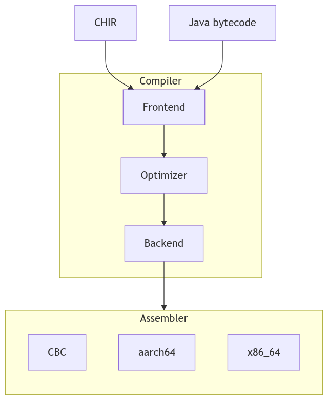

# CBC compiler

## Introduction

This repository provides source code for CBC compiler, which compiles
Cangjie programs from CHIR representation used by [Cangjie compiler](https://gitcode.com/Cangjie/cangjie_compiler)
into CBC bytecode format.

## Architecture

The overall architecture is shown below:



**Architecture Description**

CBC compiler is built on top of general-purpose compiler infrastructure
that includes:

- **Frontend** for following input formats:
  - CHIR (Cangjie High-Level IR);
  - Java bytecode.
- **Optimizer** framework with support various high-level and low-level optimizations.
- **Backend** framework which performs code ordering, code selection and register allocation.
- **Assembler** for following output formats:
  - CBC (Cangjie bytecode);
  - x86_64 (amd64) machine code;
  - aarch64 (arm64) machine code.

## Directory Structure

```text
cbc_compiler/
├── core
│   ├── assembler                             # Core assembler sources (CBC, amd64, arm64)
│   ├── cbc-asm                               # CBC assember utility
│   ├── chir-lib                              # CHIR flatbuffers deserialization layer
│   ├── common-java-lib                       # Common sources between compiler and assembler
│   ├── common-rt-compiler                    # Common sources between compiler and some runtimes
│   ├── compiler                              # Main compiler sources
│   │   └── src
│   │       ├── common                        # Common compiler-specific sources
│   │       ├── lambda-type-gen-impl          # Lambda type generator
│   │       ├── newbaseline-code-generator    # Code generator module of lower-tier compiler
│   │       ├── o2-lib                        # Compilation driver and compilation project system
│   │       ├── opt                           # General-purpose code optimizer
│   │       ├── starter                       # Main compiler entrypoint
│   │       ├── wrapper-compiler              # Generator of various function wrappers
│   │       ├── xminizip                      # Bindings for minizip
│   │       └── xpackii                       # Rsulting binary artifact management module
│   └── xscala-vm-dependent                   # Internal library for support of different compiler VM
├── figures                                   # Documentation images
└── project                                   # SBT buildsystem configuration
```

## Constraints

Currently, building Cangjie compiler artifacts directly in the Windows environment is not supported. Instead, you need to generate compiler artifacts that can run on Windows through cross-compilation in a Linux environment. For details, see the [Cangjie SDK Integration Build Guide](https://gitcode.com/Cangjie/cangjie_build/blob/main/README.md). For future support plans, refer to the [Platform Support Roadmap](#platform-support-roadmap).

## Building from Source

### Prerequisites

Building compiler requires
- Java 8 or higher
- [sbt](https://www.scala-sbt.org)
- [flatc](https://flatbuffers.dev/flatc/) v25.2.10 or higher

<details>
<summary>Installing prerequisites on Ubuntu</summary>

Java 21

```bash
sudo apt install openjdk-21-jdk
```

Latest sbt [instructions](https://www.scala-sbt.org/download/)

```bash
curl -sL "https://keyserver.ubuntu.com/pks/lookup?op=get&search=0x2EE0EA64E40A89B84B2DF73499E82A75642AC823" | sudo gpg --dearmor -o /etc/apt/keyrings/scalasbt.gpg
echo "deb [signed-by=/etc/apt/keyrings/scalasbt.gpg] https://repo.scala-sbt.org/scalasbt/debian all main" | sudo tee /etc/apt/sources.list.d/sbt.list
sudo apt-get update
sudo apt-get install sbt
```

Flatbuffers v25.2.10 [building from source](https://flatbuffers.dev/building/)

```bash
git clone --branch v25.2.10 https://github.com/google/flatbuffers.git
cd flatbuffers/
cmake -G "Unix Makefiles" -DCMAKE_BUILD_TYPE=Release
make
mkdir -p ~/.local/bin
cp ./flatc ~/.local/bin
```

coursier

```bash
mkdir -p ~/.local/bin
curl -fL "https://github.com/coursier/launchers/raw/master/cs-x86_64-pc-linux.gz" | gzip -d > ~/.local/bin/cs
chmod +x ~/.local/bin/cs
cs setup
```

</details>

For ease of development, it is advised to copy [env.properties.sample](/env.properties.sample)
to `env.properties`, uncomment and modify corresponding properties for configuration:

- `arch` - target arch (`amd64` or `arm64`)
- `mode` - build mode (`work` or `enduser`), for release builds use `enduser`

The rest of properties are optional and are needed for internal development with other non-CBC related projects.

> Without `env.properties` all of the options will need to be explicitly passed
> to `sbt` commands with `-D` prefix, for example like this:
> ```bash
> $ sbt -Darch=amd64 -Dmode=enduser ...
> ```

### Build

Building this project from source is done using `sbt jar`:

```bash
$ sbt jar
...
[info] Built: /.../core/compiler/target/aot/aot.jar
[info] Jar hash: 4470686bdf8e07fa6d1ac2bb044d50899f0699db
[success] Total time: 36 s, completed Jun 22, 2026 11:30:14 AM
```

The resulting compiler jar will be located at [core/compiler/target/aot/aot.jar](core/compiler/target/aot/aot.jar).

### Test

Unit tests for all components can be run using `sbt test` command.

```bash
$ sbt test
...
[info] All tests passed.
[success] Total time: 76 s (0:01:16.0), completed Jun 22, 2026 11:32:22 AM
```

### Run

In order to produce CBC from CHIR file, it is enough to pass `.chir` file directly to compiler:

```bash
$ java -jar core/compiler/target/aot/aot.jar test.chir
```

The resulting CBC file will have name `test.cbc`, but can be changed with option `-outputname=<name>`.
Then the resulting CBC file will have name `<name>.cbc`.

The input CHIR file is expected to be produced from cjc compilation with option `--emit-chir`:

```bash
$ cjc --emit-chir test.cj
```

## License

This project is licensed under [Apache-2.0 with Runtime Library Exception](./LICENSE).

## Related Repositories

- [cangjie_compiler](https://gitcode.com/Cangjie/cangjie_compiler)
