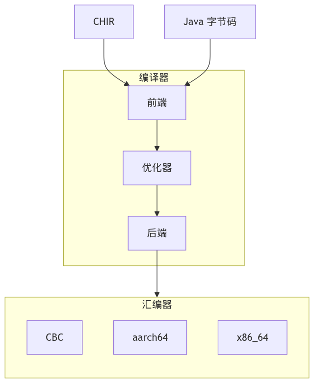

# CBC 编译器

## 简介

本仓库提供 CBC 编译器的源代码，该编译器将 [Cangjie 编译器](https://gitcode.com/Cangjie/cangjie_compiler) 使用的 CHIR 表示形式的 Cangjie 程序编译为 CBC 字节码格式。

## 架构

整体架构如下所示：



**架构说明**

CBC 编译器建立在通用编译器基础设施之上，包括：

- **前端** 支持以下输入格式：
  - CHIR（Cangjie 高级中间表示）；
  - Java 字节码。
- **优化器** 框架，支持多种高层次和低层次优化。
- **后端** 框架，执行代码排序、代码选择和寄存器分配。
- **汇编器** 支持以下输出格式：
  - CBC（Cangjie 字节码）；
  - x86_64（amd64）机器码；
  - aarch64（arm64）机器码。

## 目录结构

```text
cbc_compiler/
├── core
│   ├── assembler                             # 核心汇编器源码（CBC、amd64、arm64）
│   ├── cbc-asm                               # CBC 汇编器工具
│   ├── chir-lib                              # CHIR flatbuffers 反序列化层
│   ├── common-java-lib                       # 编译器和汇编器之间的公共源码
│   ├── common-rt-compiler                    # 编译器和某些运行时之间的公共源码
│   ├── compiler                              # 主编译器源码
│   │   └── src
│   │       ├── cangjie-java-class-gen-impl   # 用于 Cangjie-Java 互操作的 Java 类文件生成器
│   │       ├── common                        # 编译器特定公共源码
│   │       ├── lambda-type-gen-impl          # Lambda 类型生成器
│   │       ├── lazy-jit-stubs-generator      # 适配器和存根生成器
│   │       ├── newbaseline                   # 较低层编译器
│   │       ├── newbaseline-code-generator    # 较低层编译器的代码生成模块
│   │       ├── o2-lib                        # 编译驱动和编译项目系统
│   │       ├── opt                           # 通用代码优化器
│   │       ├── starter                       # 编译器主入口
│   │       ├── symlevel-light                # 类型、成员和字段表示
│   │       ├── verifier                      # Java 字节码验证器接口
│   │       ├── verifier-impl                 # Java 字节码验证器实现
│   │       ├── wrapper-compiler              # 各种函数包装器生成器
│   │       ├── xminizip                      # minizip 绑定
│   │       └── xpackii                       # 生成的二进制工件管理模块
│   └── xscala-vm-dependent                   # 支持不同编译器 VM 的内部库
├── figures                                   # 文档图像
├── project                                   # SBT 构建系统配置
└── scala
    └── plugins
        └── java-friendly-enums               # Scala 编译器插件
```

## 约束条件

当前，不支持直接在 Windows 环境中构建 Cangjie 编译器工件。相反，您需要通过 Linux 环境中的交叉编译生成可在 Windows 上运行的编译器工件。详细信息参见 [Cangjie SDK 集成构建指南](https://gitcode.com/Cangjie/cangjie_build/blob/main/README.md)。有关未来的支持计划，请参见 [平台支持路线图](#platform-support-roadmap)。

## 从源码构建

### 前置条件

构建编译器需要：
- Java 8 或更高版本
- [sbt](https://www.scala-sbt.org)
- [flatc](https://flatbuffers.dev/flatc/) v25.2.10 或更高版本

为了便于开发，建议将 [env.properties.sample](/env.properties.sample) 复制为 `env.properties`，取消注释并修改相应的属性进行配置：

- `os` - 目标操作系统（`windows` 或 `linux`），CBC 使用 `linux`
- `arch` - 目标架构（`amd64` 或 `arm64`）
- `mode` - 构建模式（`work` 或 `enduser`），发布版本使用 `enduser`
- `language.pack` - 输入语言配置（`none`、`java`、`cangjie`、`cangjie-java` 和 `scala`），
  CBC 使用 `cangjie`

其余属性为可选，仅在与其它非 CBC 相关项目的内部开发时使用。

> 如果没有 `env.properties`，则需要通过 `-D` 前缀显式传递所有选项
> 到 `sbt` 命令，例如这样：
> ```bash
> $ sbt -Dos=linux -Darch=amd64 -Dmode=enduser -Dlanguage.pack=cangjie ...
> ```

### 构建

使用 `sbt jar` 命令从源码构建此项目：

```bash
$ sbt jar
...
[info] Built: /.../core/compiler/target/aot/aot.jar
[info] Jar hash: 4470686bdf8e07fa6d1ac2bb044d50899f0699db
[success] Total time: 36 s, completed Jun 22, 2026 11:30:14 AM
```

生成的编译器 jar 文件位于 [core/compiler/target/aot/aot.jar](core/compiler/target/aot/aot.jar)。

### 测试

使用 `sbt test` 命令运行所有组件的单元测试。

```bash
$ sbt test
...
[info] All tests passed.
[success] Total time: 76 s (0:01:16.0), completed Jun 22, 2026 11:32:22 AM
```

### 运行

要将 CHIR 文件转换为 CBC，只需将 `.chir` 文件直接传递给编译器：

```bash
$ java -jar core/compiler/target/aot/aot.jar test.chir
```

生成的 CBC 文件名为 `test.cbc`，但可以使用 `-outputname=<name>` 选项更改。
此时生成的 CBC 文件名为 `<name>.cbc`。

输入的 CHIR 文件预期由 `--emit-chir` 选项通过 cjc 编译生成：

```bash
$ cjc --emit-chir test.cj
```

## 许可证

本项目根据 [Apache-2.0 + 运行时库异常](./LICENSE) 许可证获得许可。

## 相关仓库

- [cangjie_compiler](https://gitcode.com/Cangjie/cangjie_compiler)
